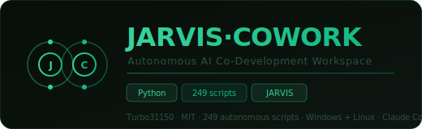
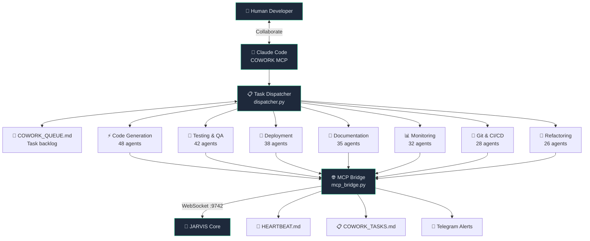
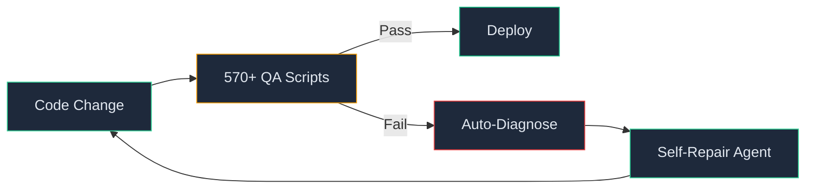

<div align="center">
  
  <br/><br/>

  [](LICENSE)
  [](#)
  [](#agent-categories)
  [](#qa--self-repair)
  [](#)
  [](#mcp-integration)
  [](#jarvis-integration)
  [](#contributing)

  <br/>
  <h3>AI collaborative workspace &mdash; 570+ QA scripts with self-repair</h3>
  <p><em>Orchestrate continuous AI-driven development sessions across code generation, testing, deployment, documentation, and monitoring &mdash; all powered by the JARVIS ecosystem.</em></p>

  <br/>

  [Architecture](#architecture) &bull; [Agent Categories](#agent-categories) &bull; [QA & Self-Repair](#qa--self-repair) &bull; [Quick Start](#quick-start) &bull; [MCP Integration](#mcp-integration) &bull; [Contributing](#contributing)
</div>

---

## Why JARVIS COWORK?

Modern software development involves repetitive cycles of scaffolding, testing, deploying, and documenting. **JARVIS COWORK** automates these cycles through **249 specialized agents** and **570+ QA scripts** that work autonomously or semi-autonomously, orchestrated by a central dispatcher connected to Claude Code via the Model Context Protocol (MCP).

**Key differentiators:**
- **Full lifecycle coverage** &mdash; from code generation to production monitoring
- **Self-repair pipeline** &mdash; 570+ QA scripts detect and auto-fix regressions
- **Persistent context** &mdash; live system state tracked in `HEARTBEAT.md` across sessions
- **Multi-model orchestration** &mdash; routes tasks to the best model in the JARVIS cluster
- **MCP-native** &mdash; first-class Claude Code integration via WebSocket bridge
- **Cross-platform** &mdash; identical behavior on Windows and Linux

---

## Architecture



> **Human-Agent collaboration loop**: The developer sets intent, agents execute autonomously, results flow back for review, and the cycle repeats with persistent context across sessions.

---

## Agent Categories

| Category | Count | Description | Key Capabilities |
|:---------|:-----:|:------------|:-----------------|
| **Code Generation** | 48 | Scaffolding, templates, boilerplate | Project init, API stubs, model generation |
| **Testing & QA** | 42 | Automated test suites and coverage | pytest orchestration, coverage reports, linting |
| **Deployment** | 38 | Build, ship, and run | Docker builds, systemd services, CI/CD triggers |
| **Documentation** | 35 | Auto-generated docs | README generation, changelogs, docstring injection |
| **Monitoring** | 32 | Health and observability | Health checks, log aggregation, alert routing |
| **Git & CI/CD** | 28 | Source control automation | Auto-commits, PR creation, branch management |
| **Refactoring** | 26 | Code quality improvements | Dead code removal, migration scripts, formatting |
| **Total** | **249** | | |

---

## QA & Self-Repair

JARVIS COWORK includes **570+ QA scripts** that form a self-repairing development pipeline:



| Capability | Description |
|:-----------|:------------|
| **Regression detection** | QA scripts run after every agent action to catch regressions |
| **Auto-diagnosis** | Failed tests are analyzed to identify root cause |
| **Self-repair** | Repair agents generate and apply fixes autonomously |
| **Persistent context** | `HEARTBEAT.md` tracks system state across sessions |
| **Multi-model routing** | Tasks routed to the optimal model (M1/M3/OL1) based on complexity |

---

## Quick Start

### Prerequisites

- Python 3.11+
- Access to JARVIS WebSocket broker (`:9742`)
- Claude Code with MCP support (optional, for interactive sessions)

### Installation

```bash
git clone https://github.com/Turbo31150/jarvis-cowork.git
cd jarvis-cowork
pip install -r requirements.txt
```

### Run a Session

```bash
# Start the Cowork engine
python cowork_engine.py

# Dispatch a specific task
python cowork_dispatcher.py --task "generate_tests" --target "src/trading/"

# Deploy all agents
python deploy_cowork_agents.py --all

# Monitor real-time state
watch -n2 cat HEARTBEAT.md
```

---

## MCP Integration

JARVIS COWORK exposes a full MCP bridge for Claude Code and other MCP-compatible clients.

```python
from cowork_mcp_bridge import CoworkBridge

bridge = CoworkBridge(jarvis_ws="ws://127.0.0.1:9742")

# Dispatch tasks programmatically
await bridge.dispatch("refactor_module", path="core/agent_manager.py")
await bridge.dispatch("generate_docs", path="modules/trading/")
await bridge.dispatch("run_tests", path="tests/", coverage=True)
```

### Available MCP Tools

| Tool | Description |
|:-----|:------------|
| `dispatch_task` | Send a task to the agent pool |
| `list_agents` | List all available agents and their status |
| `get_heartbeat` | Retrieve current system state |
| `cancel_task` | Cancel a running or queued task |
| `get_results` | Fetch results from completed tasks |

---

## API Reference

### Cowork Engine

```python
from cowork_engine import CoworkEngine

engine = CoworkEngine(config="config.yaml")
engine.start()                          # Start processing queue
engine.enqueue("generate_tests", target="src/")
engine.status()                         # Returns current heartbeat
```

### Task Dispatcher

```python
from cowork_dispatcher import Dispatcher

dispatcher = Dispatcher()
result = dispatcher.run(
    task="scaffold_module",
    target="modules/new_feature/",
    template="fastapi"
)
```

---

## Project Structure

```
jarvis-cowork/
├── cowork_engine.py         # Core engine — processes task queue
├── cowork_dispatcher.py     # Task routing to agent pools
├── cowork_mcp_bridge.py     # MCP bridge for Claude Code
├── deploy_cowork_agents.py  # Agent deployment orchestrator
├── AGENTS.md                # Agent definitions and capabilities
├── IDENTITY.md              # System identity and role
├── INSTRUCTIONS.md          # Usage instructions
├── SOUL.md                  # Philosophy and values
├── TOOLS.md                 # Available tool catalog
├── WORKFLOW_AUTO.md         # Automated workflow definitions
├── COWORK_QUEUE.md          # Live task backlog
├── COWORK_TASKS.md          # Task history and results
├── HEARTBEAT.md             # Real-time system state
└── dev/                     # 249 agent scripts
    ├── gen/                 # Code generation agents
    ├── test/                # Testing agents
    ├── deploy/              # Deployment agents
    ├── docs/                # Documentation agents
    ├── monitor/             # Monitoring agents
    ├── git/                 # Git & CI agents
    └── refactor/            # Refactoring agents
```

---

## JARVIS Integration

JARVIS COWORK is a core component of the [JARVIS ecosystem](https://github.com/Turbo31150). It communicates with the JARVIS supervisor via WebSocket on port `9742` and can be triggered by:

- **Voice commands** via [jarvis-whisper-flow](https://github.com/Turbo31150/jarvis-whisper-flow)
- **Trading events** via [TradeOracle](https://github.com/Turbo31150/TradeOracle)
- **Cluster scheduling** via [JARVIS-CLUSTER](https://github.com/Turbo31150/JARVIS-CLUSTER)
- **Manual dispatch** via Claude Code MCP

---

## Contributing

Contributions are welcome. Please open an issue first to discuss what you would like to change.

1. Fork the repository
2. Create a feature branch (`git checkout -b feature/my-agent`)
3. Add your agent script in the appropriate `dev/` subdirectory
4. Submit a Pull Request

---


---

## What is Cowork Mode?

Cowork Mode is **human-AI pair programming** taken to its logical extreme. You write code, and JARVIS runs **570+ QA scripts automatically** in the background, finds bugs, security issues, and regressions -- then **self-repairs** them without you lifting a finger. It is like having a senior developer reviewing every line you write in real-time, except this one never sleeps and checks 570 things simultaneously.

The key insight: instead of writing tests after code (which nobody does consistently), Cowork Mode runs the entire QA suite **after every agent action**, catching problems the moment they are introduced.

## Example Session

```
Human: "Add authentication to the API"

JARVIS: Generating auth module via code-gen agent...
        Running 570 QA scripts...
          ✅ 568 passed
          ❌ 2 failed:
             - test_cors_headers: missing CORS headers for /auth/* endpoints
             - test_sql_injection: raw string interpolation in user lookup query

JARVIS: Auto-fixing via self-repair agent...
        - Added CORS middleware for auth routes
        - Replaced raw SQL with parameterized queries
        Re-running QA...
          ✅ 570/570 passed

JARVIS: Auth module deployed. 0 regressions. PR ready for review.
```

This loop -- **generate, test, diagnose, repair, re-test** -- runs continuously and autonomously. The human sets intent, agents handle execution.

## License

This project is licensed under the MIT License. See [LICENSE](LICENSE) for details.

---

<div align="center">
  <br/>
  <strong>Franc Delmas (Turbo31150)</strong> &bull; <a href="https://github.com/Turbo31150">github.com/Turbo31150</a> &bull; Toulouse, France
  <br/><br/>
  <em>JARVIS COWORK &mdash; Autonomous AI Co-Development Workspace</em>
</div>
